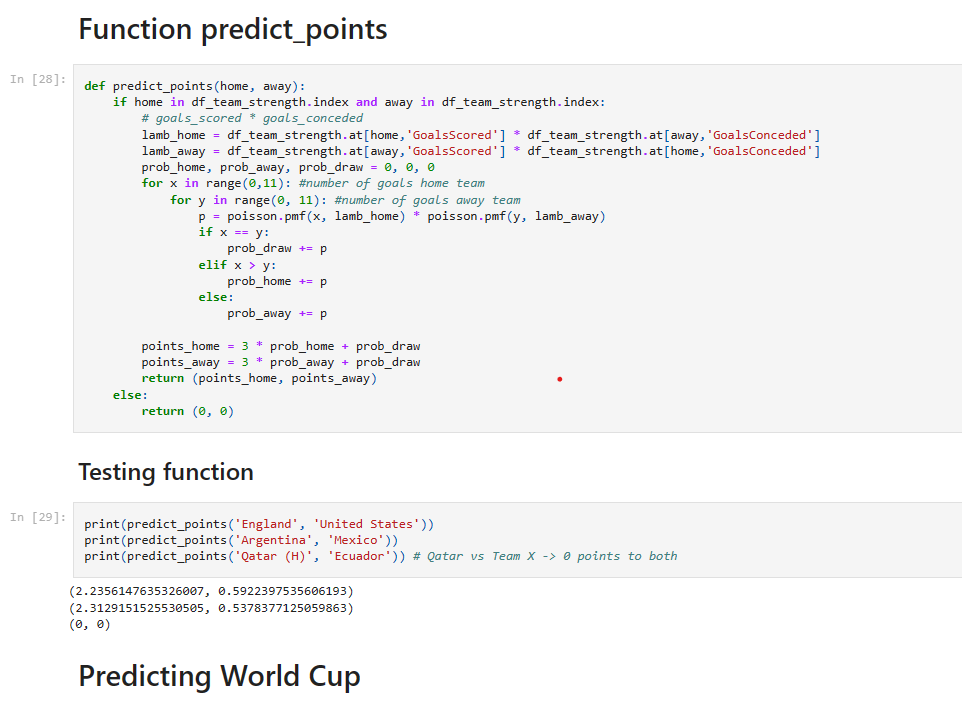

Creating a well-structured README is crucial for effectively communicating your project's purpose, functionality, and usage to potential collaborators and users. Here's a template for a README for World Cup 2026 winner prediction project::

## World Cup 2026 Prediction

# Project Description
__Objective__:
- Prediction of the winner of an international matches Prediction results are  "Win / Lose / Draw" or "goal difference"
- Apply the model to predict the result of FIFA world cup 2026.

__Data__: Data are assembled from multiple sources, most of them are from Kaggle, others come from FIFA website / EA games.

__Feature Engineering__: To determine who will more likely to win a match, based on my knowledge, I come up with 4 main groups of features as follows:
1. head-to-head match history between 2 teams
2. recent performance of each team (10 recent matches), aka "form"
3. bet-ratio before matches
4. squad strength (from FIFA video game)

Feature list reflects those factors.

__Lifecycle__

# Project Structure
1. __EDA__: Data Exploratory Analysis
2. __DM__: Data Modeling (KNN, Decision Trees)
3. __Visualisation__: Visualisation
4. __save_model__: saved Machine Learning model after training

## Prerequisites
List the prerequisites or dependencies users need to install and run your project. Include links to relevant documentation or resources.

Python (>=3.6)
Streamlit
Pandas
Pickle
Scipy

[1]: https://www.kaggle.com/ahmedelnaggar/fifa-worldcup-2018-dataset/data
[2]: https://www.kaggle.com/martj42/international-football-results-from-1872-to-2017/data
[3]: https://www.fifa.com/fifa-world-ranking/ranking-table/men/index.html
[4]: https://www.kaggle.com/austro/beat-the-bookie-worldwide-football-dataset/data
[5]: http://www.oddsportal.com
[6]: https://sofifa.com/players/top
[7]: https://www.fifaindex.com/

## Installation 

Provide step-by-step instructions for users to install your project.

git clone https://github.com/AhmetA97/FIFA_World_Cup_2026_Prediction

## Usage

1. Run the Streamlit app:
``
streamlit run app.py
``
2. Open the provided URL in your web browser.

3. Adjust input features in the sidebar to predict customer churn.

4. Click the "Predict" button to see the prediction outcome.

# Data
### Data Source
The dataset are from all international matches from 2000 - 2018, results, bet odds, ranking, squad strengths
1. [FIFA World Cup 2022](https://www.kaggle.com/datasets/ashishmotwani/fifa-world-cup-2022)
2. [International match 1872 - 2024](https://www.kaggle.com/datasets/martj42/international-football-results-from-1872-to-2017)
3. [FIFA Ranking through Time](https://www.fifa.com/fifa-world-ranking/ranking-table/men/index.html)
4. [Bet Odd](https://www.kaggle.com/austro/beat-the-bookie-worldwide-football-dataset/data)
5. [Bet Odd 2](http://www.oddsportal.com)
6. [Squad Strength - Sofia](https://sofifa.com/players/top)
7. [Squad Strength - FIFA index](https://www.fifaindex.com/)

