# Table of Contents
1. [Introduction](#introduction)
2. [Data](#data)
3. [Exploratory Data Analysis](#exploratory-data-analysis)
4. [Methodology](#methodology):
    Details about your procedure
5. [Models](#models)
6. [Visualisation](#visualisation)
7. [Conclusion](#conclusion)
8. [References](#references)

# Introduction

__Abstract__:

In this work, we compare 9 different modeling approaches for the soccer matches and goal difference on all international matches from 2005 - 2017,  FIFA World Cup 2018 - 2022 and FIFA EURO 2016-2020. Within this comparison, while performance of "Win / Draw / Lose" predictions shows not much difference, "Goal Difference" prediction is quite favored to Random Forest and squad-strength based decision tree. We also apply these models in World Cup 2022 and again, Random Forest and Logistic Regression predicts about 33% acccuracy for "Goal Difference" and about 57% for "Win / Draw / Lose". However a simple decision tree based on bet odd and squad-strength are also comparable.

__Objective__:
- Prediction of the winner of an international matches Prediction results are  "Win / Lose / Draw" or "goal difference"
- Apply the model to predict the result of FIFA world cup 2026.


__Lifecycle__


# Data
__Data__: The dataset are from all international matches from 2000 - 2022, results, bet odds, ranking, squad strengths.
1. [FIFA World Cup 2022][1]
2. [International match 1872 - 2024][2]
3. [FIFA Ranking through Time][3]
4. [Bet Odd][4]
5. [Bet Odd 2][5]
6. [Squad Strength - Sofia][6]
7. [Squad Strength - FIFA index][7]

[1]: https://www.kaggle.com/datasets/ashishmotwani/fifa-world-cup-2022
[2]: https://www.kaggle.com/datasets/martj42/international-football-results-from-1872-to-2017
[3]: https://www.fifa.com/fifa-world-ranking/ranking-table/men/index.html
[4]: https://www.kaggle.com/austro/beat-the-bookie-worldwide-football-dataset/data
[5]: http://www.oddsportal.com
[6]: https://sofifa.com/players/top
[7]: https://www.fifaindex.com/

__Feature Selection__: To determine who will more likely to win a match, based on my knowledge, I come up with 4 main groups of features as follows:
1. __head-to-head match history between 2 teams__. Some teams have few opponents who they hardly win no matter how strong they currently are. For example [Germany team usually loses / couldn't beat Italian team in 90 minute matches.](https://www.11v11.com/teams/italy/tab/opposingTeams/opposition/Germany/)
2. __Recent performance of each team (10 recent matches), aka "form"__ A team with "good" form usually has higher chance to win next matches.
3. __Bet-ratio before matches__ Odd bookmarkers already did many analysis before matches to select the best betting odds so why don't we include them.
4. __Squad strength (from FIFA video game).__ We want a real squad strength but these data are not free and not always available so we use strength from FIFA video games which have updated regularly to catch up with the real strength.

__Feature List__ Feature list reflects those four factors.

- _*difference: team1 - team2_
- _*form: performance in 10 recent matches_

| Feature Name  | Description              | Source |
|:-------------:|:------------------------:|:------:|
| team_1        | Nation Code (e.g US, NZ)      | [1] & [2] |
| team_2        | Nation Code  (e.g US, NZ)     | [1] & [2] |
| date          | Date of match yyyy - mm - dd  | [1] & [2] |
| tournament    | Friendly,EURO, AFC, FIFA WC   | [1] & [2] |
| h_win_diff    | Head2Head: win difference      |   [2]   |
| h_draw        | Head2Head: number of draw      |   [2]    |
| form_diff_goalF | Form: difference in "Goal For" |   [2]   |
| form_diff_goalA | Form: difference in "Goal Against" |   [2]    |
| form_diff_win   | Form: difference in number of win  |   [2]    |
| form_diff_draw  | Form: difference in number of draw |   [2]    |
| odd_diff_win    | Betting Odd: difference bet rate for win  | [4] & [5] |
| odd_draw        | Betting Odd: bet rate for draw            | [4] & [5] |
| game_diff_rank  | Squad Strength: difference in FIFA Rank   | [3] |
| game_diff_ovr   | Squad Strength: difference in Overall Strength  | [6] |
|game_diff_attk   | Squad Strength: difference in Attack Strength   | [6] |
|game_diff_mid    | Squad Strength: difference in Midfield Strength | [6] |
|game_diff_def    | Squad Strength: difference in Defense Strength  | [6] |
|game_diff_prestige | Squad Strength: difference in prestige        | [6] |
|game_diff_age11    | Squad Strength: difference in age of 11 starting players  | [6] |
|game_diff_ageAll   | Squad Strength: difference in age of all players          | [6] |
|game_diff_bup_speed| Squad Strength: difference in Build Up Play Speed         | [6] |
|game_diff_bup_pass | Squad Strength: difference in Build Up Play Passing       | [6] |
|game_diff_cc_pass  | Squad Strength: difference in Chance Creation Passing     | [6] |
|game_diff_cc_cross | Squad Strength: difference in Chance Creation Crossing    | [6] |
|game_diff_cc_shoot | Squad Strength: difference in Chance Creation Shooting    | [6] |
|game_diff_def_press| Squad Strength: difference in Defense Pressure            | [6] |
|game_diff_def_aggr | Squad Strength: difference in Defense Aggression          | [6] |
|game_diff_def_teamwidth  | Squad Strength: difference in Defense Team Width    | [6] |


# Exploratory Data Analysis
There are few questions in order to understand data better

__Imbalance of data__

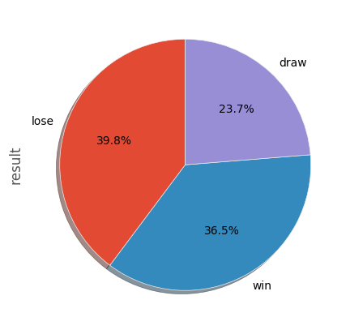
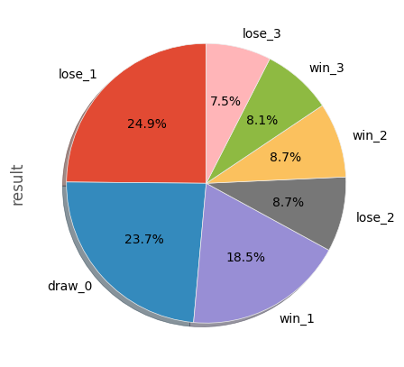

__Correlation between variables__

First we draw correlation matrix of large dataset which contains all matches from 2005-2022 with features group 1,2 and 3
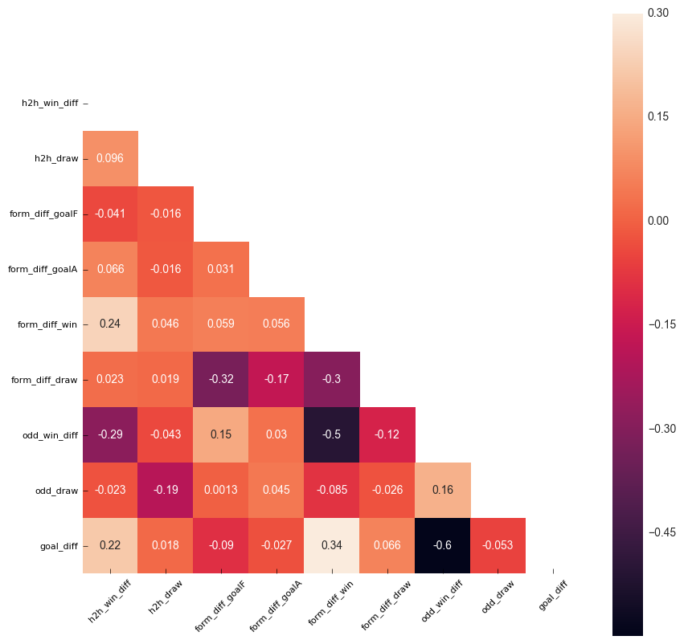

In general, features are not correlated. "odd_win_diff" is quite negatively correlated with "form_diff_win" (-0.5), indicating that form of two teams reflex belief of odd bookmarkers on winners. One more interesting point is when difference of bet odd increases we would see more goal differences (correlation score = -0.6).
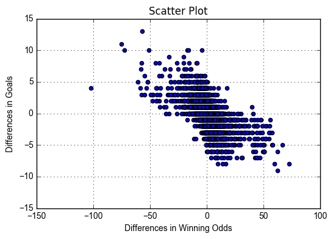

Second, we draw correlation matrix of small dataset which contains all matches from World Cup 2014, 2018, 2022 and EURO 2016, 2020
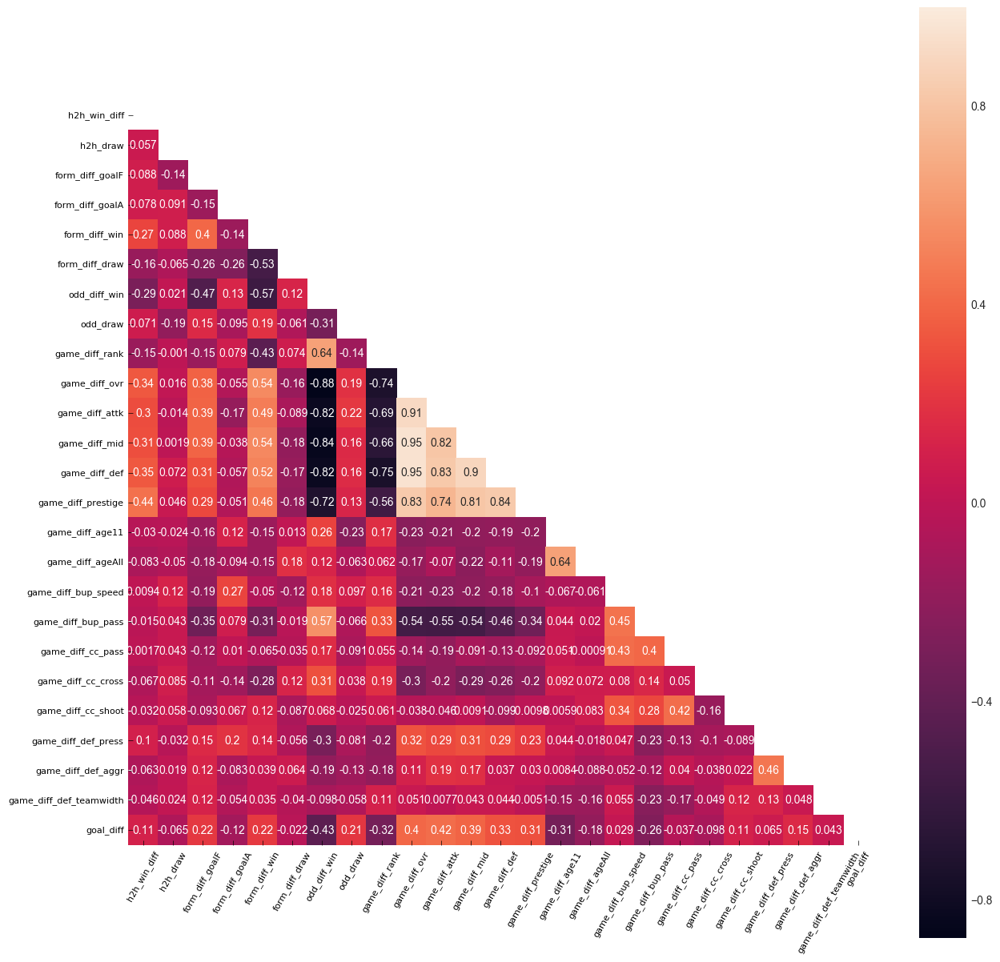

Overall rating is just an average of "attack", "defense" and "midfield" index therefore we see high correlation between them. In addition, some of new features of squad strength show high correlation for example "FIFA Rank", "Overall rating" and "Difference in winning odd"
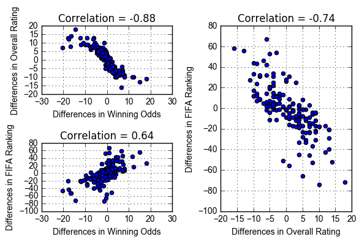

__How head-to-head matchup history affect the current match?__

You may think when head-to-head win difference is positive, match result should be "Win" (Team 1 wins Team 2) and vice versa, when head-to-head win difference is negative, match result should be "Lose" (Team 2 wins Team 1). In fact, positive head-to-head win difference indicates that there is 51.8% chance the match results end up with "Win" and negative head-to-head win difference indicates that there is 55.5% chance the match results end up with "Lose"
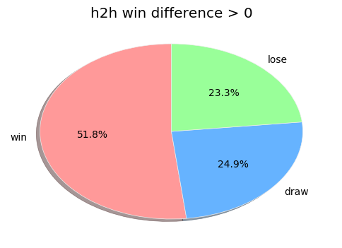
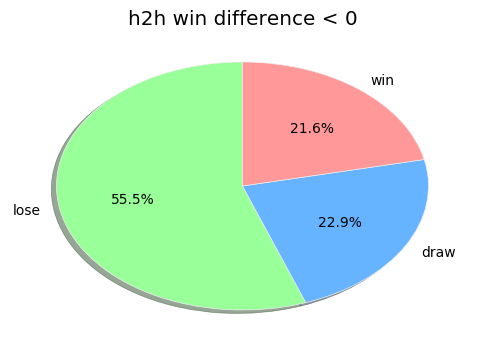

Let's perform our hypothesis testing with two-sampled t-test
Null Hypothesis: There is no difference of 'h2h win difference' between "Win" and "Lose"
Alternative Hypothesis: There are differences of 'h2h win difference' between "Win" and "Lose"

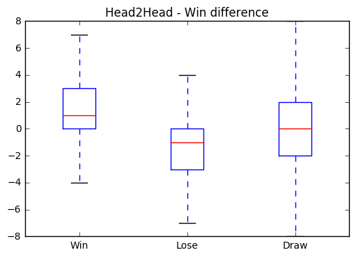

```
T-test between win and lose:
Ttest_indResult(statistic=24.30496036405259, pvalue=2.503882847793891e-126)
```
Very small of p-value means we can reject the null hypothesis and accept alternative hypothesis.

We can do the same procedure with win-draw and lose-draw

```
T-test between win and draw:
Ttest_indResult(statistic=7.8385466293651023, pvalue=5.395456011352264e-15)

T-test between lose and draw:
Ttest_indResult(statistic=-8.6759649601068887, pvalue=5.2722587025773183e-18)

```
Therefore, we can say __history of head-to-head matches of two teams contribute significantly to the result__

__How 10-recent performances affect the current match?__

We consider differences in "Goal For" (how many goals they got), "Goal Against" (how many goals they conceded), "number of winning matches" and "number of drawing matches". We performed same procedure as previous questions. From pie charts, we can see a clear distinction in "number of wins" where proportion of "Win" result decreases from 49% to 25% while "Lose" result increases from 26.5% to 52.3%.

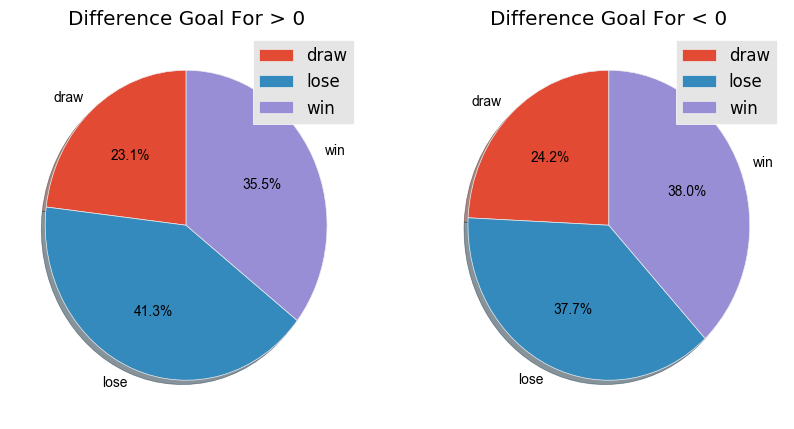
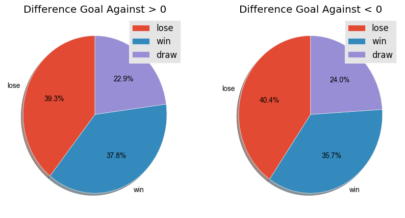
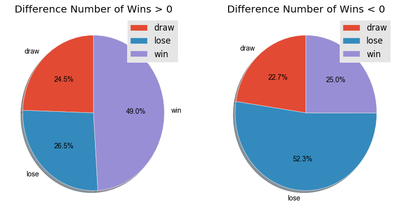
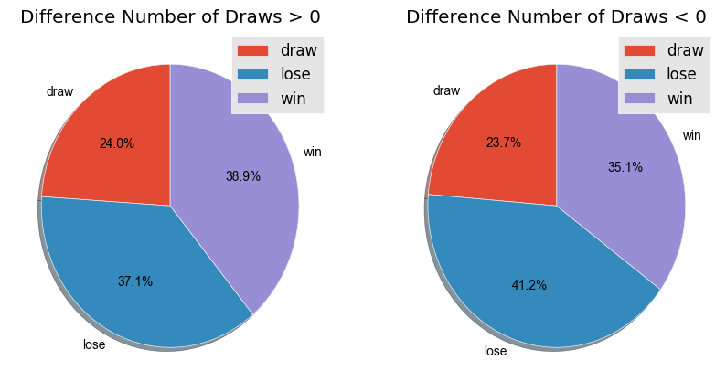

Pie charts are not enough we should do the hypothesis testing to see significance of each feature

| Feature Name  | t-test between 'win' and 'lose' | t-test between 'win' and 'draw' | t-test between 'lose' and 'draw' |
|:-------------:|:-------------------------------:|:-------------------------------:|:--------------------------------:|
| Goal For | pvalue = 2.50e-126 | pvalue = 5.39e-15 | pvalue = 5.27e-18 |
| Goal Against | pvalue = 0.60 | pvalue = 0.17 | pvalue = 0.08 |
| Number of Winning Matches | pvalue = 3.02e-23 | pvalue = 1.58e-33 | pvalue = 2.57e-29 |
| Number of Draw Matches | pvalue = 1.53e-06 | pvalue = 0.21 | pvalue = 0.03 |

We see many small value of p-value in cases of "Goal For" and "Number of Winning Matches". Based on t-test, __we know difference in "Goal For" and "Number of Winning Matches" are helpful features__

__Do stronger teams usually win?__

We define stronger teams based on
 - Higher FIFA Ranking
 - Higher Overall Rating


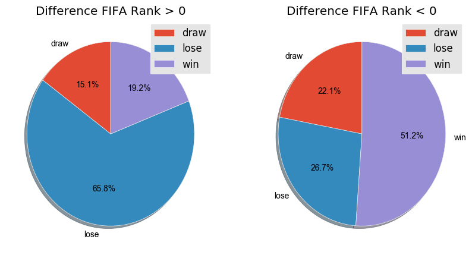
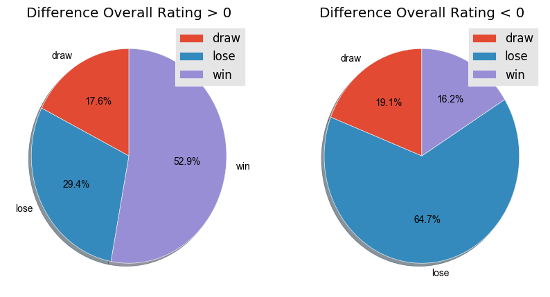

| Feature Name  | t-test between 'win' and 'lose' | t-test between 'win' and 'draw' | t-test between 'lose' and 'draw' |
|:-------------:|:-------------------------------:|:-------------------------------:|:--------------------------------:|
| FIFA Rank | pvalue = 2.11e-10 | pvalue=0.65 | pvalue=0.00068 |
| Overall Rating| pvalue = 1.53e-16 | pvalue = 0.0804 | pvalue = 0.000696 |


__Do young players play better than old one ?__

Young players may have better stamina and more energy while older players have more experience. We want to see how age affects match results.

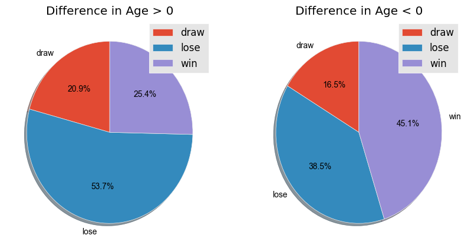

| Feature Name  | t-test between 'win' and 'lose' | t-test between 'win' and 'draw' | t-test between 'lose' and 'draw' |
|:-------------:|:-------------------------------:|:-------------------------------:|:--------------------------------:|
| Age | pvalue = 2.07e-05| pvalue = 0.312 | pvalue=0.090 |

Based on t-test and pie chart, we know that the age contributes significantly to the result. More specifically, younger teams tends to play better than older ones

__Is short pass better than long pass ?__
Higher value of "Build Up Play Passing" means "Long Pass" and lower value  means "Short Pass", value in middle mean "Mixed-Type Pass"

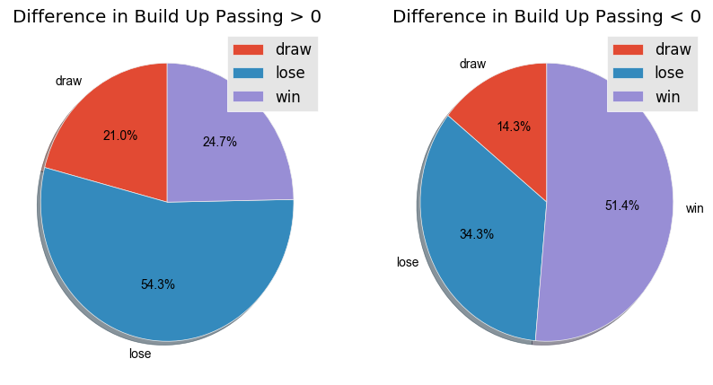

| Feature Name  | t-test between 'win' and 'lose' | t-test between 'win' and 'draw' | t-test between 'lose' and 'draw' |
|:-------------:|:-------------------------------:|:-------------------------------:|:--------------------------------:|
| Age | pvalue = 1.05e-07| pvalue = 0.0062 | pvalue = 0.571 |

Based on t-test and pie chart, we know that the age contributes significantly to the result. More specifically, teams who replies on "Longer Pass" usually loses the game.

__How does crossing pass affect match result ?__

__How does chance creation shooting affect match result ?__

__How does defence pressure affect match result ?__

__How does defence aggression affect match result ?__

__How does defence team width affect match result ?__

__How labels distribute in reduced dimension?__

  For this question, we use PCA to pick two first principal components which best explained data. Then we plot data in new dimension

   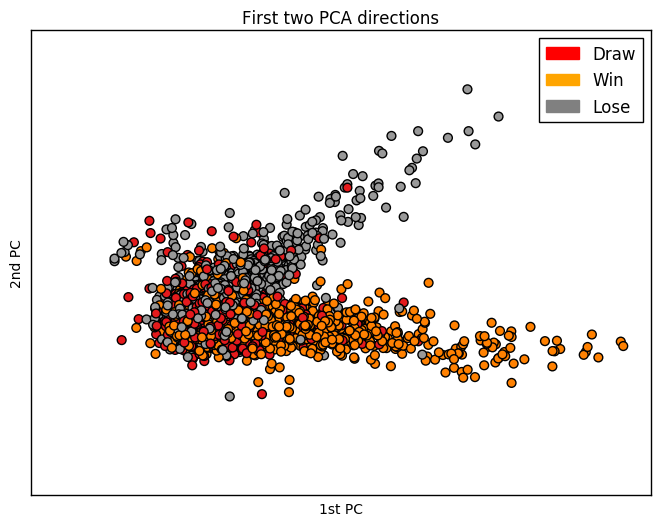

   While "Win" and "Lose" are while separate, "Draw" seems to be mixed between other labels.

# Methodology
Our main objectives of prediction are "Win / Lose / Draw" and "Goal Difference".
In this work, we do two main experiments, for each experiment we follow these procedure
 - Split data into 70:30
 - First we perform "normalization" of features, convert category to number
 - Second we perform k-fold cross validation to select the best parameters for each model based on some criteria.
 - Third we use the best model to do prediction on 10-fold cross validation (9 folds for training and 1 fold for testing) to achieve the mean of test error. This error is more reliable.


 __Team A vs Team B__
 - "win_1": A wins with 1 goal differences
 - "win_2": A wins with 2 goal differences
 - "win_3": A wins with 3 or more goal differences
 - "lose_1": B wins with 1 goal differences
 - "lose_2": B wins with 2 goal differences
 - "lose_3": A wins with 3 or more goal differences
 - "draw_0": Draw

_
## Models

### K-Nearest Neighbor (KNN)
K-Nearest Neighbor (KNN) was the second model trained. Necessary tests were applied to determine the K value and the highest accuracy value was obtained when "K=48". Next, the model was trained with cross validation. And the error rate table was extracted. Also confusion matrix and certain statistics were calculated and printed.


### Logistic Regression
The Logistic Regression Model was the third model to be trained. With cross validation, the model was trained. Also confusion matrix and certain statistics were calculated and printed.


### Decision Tree
Decision Tree was the third model trained. 70% of the dataset was used for training and 30% for testing. The model was trained with cross validation. And the Decision Tree was written. In the model below, as mentioned earlier, "1" represents a win, "2" represents a draw, and "3" represents a loss. Finally, the confusion matrix and statistics were printed.


### Random Forest
Random Forest was the last model trained and was also used as the default model in match prediction stages. First, the model was trained with cross validation. Then the model, confusion matrix and some statistics were printed.


## Visualisation

https://github.com/AhmetA97/FIFA_World_Cup_2026_Prediction/blob/main/data_visualization_best_lineup.ipynb

# Conclusion

In conclusion, our machine learning model was able to accurately predict the outcomes of World Cup matches with a high degree of accuracy. Through the use of various algorithms and techniques, we were able to analyze and process large amounts of data in order to make informed predictions about the outcomes of matches.

Overall, the results of this project demonstrate the potential of machine learning in the realm of sports prediction. By harnessing the power of data and advanced computational techniques, we were able to gain valuable insights and make accurate predictions that would have been difficult to achieve through traditional methods.

While there is always room for improvement, the success of this project highlights the potential for machine learning to revolutionize the way we approach sports analysis and prediction. As such, it is likely that we will see an increasing adoption of these techniques in the future, as more and more organizations seek to harness the power of data to gain a competitive edge.


# Data Source
The dataset are from all international matches from 2000 - 2024, results, bet odds, ranking, squad strengths
1. [FIFA World Cup 2022](https://www.kaggle.com/datasets/ashishmotwani/fifa-world-cup-2022)
2. [International match 1872 - 2024](https://www.kaggle.com/datasets/martj42/international-football-results-from-1872-to-2017)
3. [FIFA Ranking through Time](https://www.fifa.com/fifa-world-ranking/ranking-table/men/index.html)
4. [Bet Odd](https://www.kaggle.com/austro/beat-the-bookie-worldwide-football-dataset/data)
5. [Bet Odd 2](http://www.oddsportal.com)
6. [Squad Strength - Sofia](https://sofifa.com/players/top)
7. [Squad Strength - FIFA index](https://www.fifaindex.com/)


[1]: https://www.kaggle.com/datasets/ashishmotwani/fifa-world-cup-2022
[2]: https://www.kaggle.com/austro/beat-the-bookie-worldwide-football-dataset/data
[3]: http://www.fifa.com/fifa-world-ranking/associations/association=usa/men/index.html
[4]: https://www.kaggle.com/austro/beat-the-bookie-worldwide-football-dataset/data
[5]: https://www.futhead.com/10/players/?page=2
[6]: https://github.com/openfootball/world-cup

# Reference
1. [A machine learning framework for sport result prediction](https://www.sciencedirect.com/science/article/pii/S2210832717301485)
2. [t-test definition](https://en.wikipedia.org/wiki/Student%27s_t-test)
3. [Confusion Matrix Multi-Label example](http://scikit-learn.org/stable/auto_examples/model_selection/plot_confusion_matrix.html#sphx-glr-auto-examples-model-selection-plot-confusion-matrix-py)
4. [Precision-Recall Multi-Label example](http://scikit-learn.org/stable/auto_examples/model_selection/plot_precision_recall.html#in-multi-label-settings)
5. [ROC curve example](http://scikit-learn.org/stable/auto_examples/model_selection/plot_roc.html#sphx-glr-auto-examples-model-selection-plot-roc-py)
6. [Model evaluation](http://scikit-learn.org/stable/modules/model_evaluation.html#precision-recall-f-measure-metrics)
7. [Tuning the hyper-parameters of an estimator](http://scikit-learn.org/stable/modules/grid_search.html)
8. [Validation curves](http://scikit-learn.org/stable/modules/learning_curve.html)
9. [Understand Bet odd format](https://www.pinnacle.com/en/betting-articles/educational/odds-formats-available-at-pinnacle-sports/ZWSJD9PPX69V3YXZ)
10. [EURO 2020 bet odd](https://checkbestodds.com/football-odds/archive-euro-2020)
